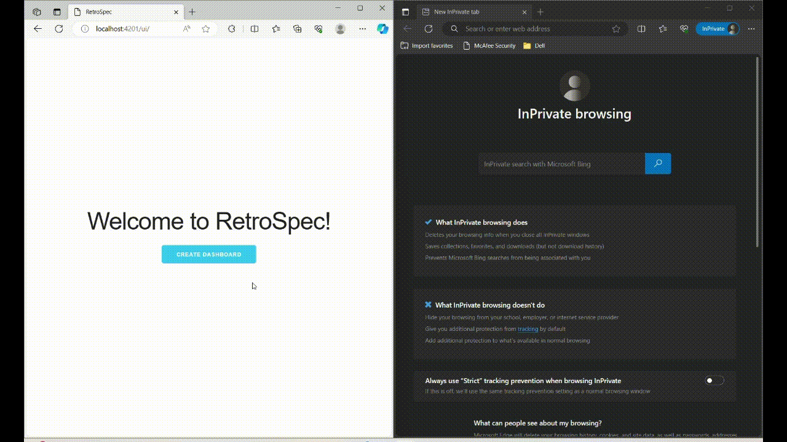

# Sprint Retrospective Dashboard
This project is an experiment that I did in order to gain an understanding of the following technologies: 
* Socket IO
* ExpressJS
* Browser XHR/Fetch
* Mongoose/MongoDB

The project uses mongo to store data like dashboard, the agile retrospective feedback buckets and broadcasts all of this data in real-time to all the active participants of the dashboard. 

# To-Do(s)
* Use React for the frontend
* Implement authentication and authorization
* A better editor instead of textarea
* Reports/Heat maps for each dashboard

# Execution
In order to run the project, you must have mongoDB running on your localhost and port 27017. Once, you have the mongoDB up and running the server can be started using the below command : 

```bash
npm run start
```

The frontend can be accessed @ http://localhost:4201/ui/. Once the dashboard is created, the URL can be shared with the participants to add points. 

# RetroSpec In Action
